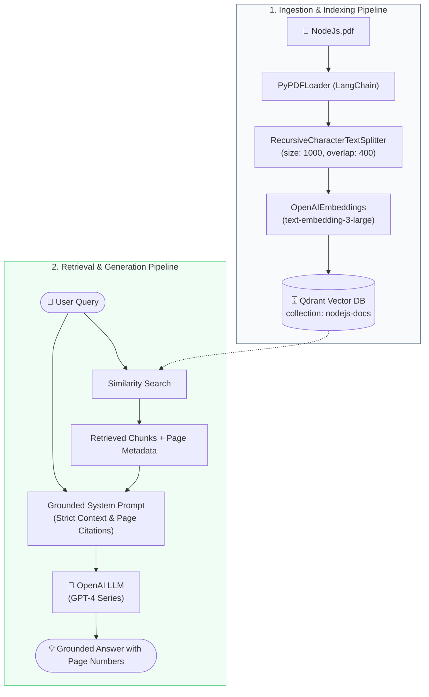

# 📚 Node.js Documentation RAG Assistant

[](https://www.python.org/)
[](https://www.langchain.com/)
[](https://qdrant.tech/)
[](https://openai.com/)
[](https://www.docker.com/)

> **A production-ready Retrieval-Augmented Generation (RAG) system built with LangChain, Qdrant Vector Database, and OpenAI to provide grounded answers with exact page-level citations from official Node.js documentation.**

---

## 🌟 Key Features

- **📄 Document Ingestion & Chunking**: Parses large technical documentation (`NodeJs.pdf`) with `PyPDFLoader` and segments text via `RecursiveCharacterTextSplitter` (1,000 chunk size, 400 overlap) to preserve semantic continuity.
- **🧠 State-of-the-Art Embeddings**: Employs OpenAI's `text-embedding-3-large` (3,072 dimensions) for rich, high-fidelity vector representations.
- **⚡ Containerized Vector Database**: Integrates a containerized [Qdrant](https://qdrant.tech/) vector engine via Docker Compose for ultra-fast nearest-neighbor similarity searches.
- **🎯 Grounded Responses & Page Citations**: Eliminates hallucinations through strict context conditioning. Every answer directs developers to the exact source page number in the original PDF.
- **💬 Interactive CLI Interface**: Lightweight, developer-friendly command-line conversational interface.

---

## 🏗️ System Architecture



---

## 🗂️ Project Structure

```text
Node-Js-Rag-Chatbot-LangGhain/
├── NodeJs_Rag/
│   ├── NodeJs.pdf             # Source technical documentation
│   ├── docker-compose.yml     # Docker configuration for local Qdrant Vector DB
│   ├── index.py               # Ingestion, chunking, and vector indexing pipeline
│   └── chat.py                # Interactive RAG CLI with similarity retrieval & citations
├── .gitignore                 # Environment and temporary file ignores
└── README.md                  # Project documentation
```

---

## 🛠️ Tech Stack & Tools

| Component | Technology | Purpose |
| :--- | :--- | :--- |
| **Orchestration** | [LangChain](https://www.langchain.com/) | Document loading, chunking, and vector store integration |
| **Vector DB** | [Qdrant](https://qdrant.tech/) | Vector storage and high-speed similarity search |
| **Embeddings** | OpenAI `text-embedding-3-large` | Semantic text representations with 3,072 dimensions |
| **LLM** | OpenAI `gpt-4.1-nano` / `gpt-4o` | Contextual response generation with strict grounding |
| **Containerization**| [Docker Compose](https://docs.docker.com/compose/) | Isolated local deployment of Qdrant service |
| **Language** | Python 3.10+ | Core implementation |

---

## 🚀 Getting Started

### 1. Prerequisites

- **Python 3.10+** installed
- **Docker Desktop** installed and running
- **OpenAI API Key** with active credits

### 2. Clone Repository

```bash
git clone https://github.com/shekharshrivas/Node-Js-Rag-Chatbot-LangGhain.git
cd Node-Js-Rag-Chatbot-LangGhain
```

### 3. Setup Virtual Environment & Dependencies

```bash
# Create virtual environment
python -m venv venv

# Activate virtual environment
# On Windows:
venv\Scripts\activate
# On Linux / macOS:
source venv/bin/activate

# Install required packages
pip install -r NodeJs_Rag/requirements.txt
```

### 4. Configure Environment Variables

Create a `.env` file inside the `NodeJs_Rag/` directory:

```env
OPENAI_API_KEY=your_openai_api_key_here
```

### 5. Launch Qdrant Vector DB

Spin up the local Qdrant instance using Docker Compose:

```bash
cd NodeJs_Rag
docker compose up -d
```

Verify that Qdrant is running by visiting the dashboard at [http://localhost:6333/dashboard](http://localhost:6333/dashboard).

### 6. Ingest & Index the Documentation

Run the indexing script to parse `NodeJs.pdf`, generate embeddings, and populate Qdrant:

```bash
python index.py
```

*Expected output:*
```text
Indexing of the document done ...
```

### 7. Run the Chat Assistant

Launch the interactive RAG CLI assistant:

```bash
python chat.py
```

---

## 💬 Example Interaction

```text
Ask something: How does the Node.js Event Loop handle microtasks vs macrotasks?

🤖: The Node.js event loop executes the microtask queue (including process.nextTick() 
and resolved Promise callbacks) immediately after the current operation and before moving 
to the next phase of the event loop.

To explore this in depth, refer to:
📖 Page: 42
📄 Source: .../NodeJs_Rag/NodeJs.pdf
```

---

## ⚙️ Engineering & Design Decisions

- **Preserving Context Integrity:** Technical documentation contains complex explanations spanning multiple paragraphs. Setting a `chunk_overlap=400` prevents crucial code snippets or context from being truncated at chunk boundaries.
- **Hallucination Guardrails:** The system prompt enforces strict context obedience—if an answer is not contained in the retrieved chunks, the model refrains from making speculative claims.
- **Traceability & Auditability:** By extracting `metadata['page_label']` and `metadata['source']` from the retrieved chunks, users can instantly verify the LLM's outputs against the original documentation.

---

## 👤 Author

**Shekhar Shrivas**
- GitHub: [@shekharshrivas](https://github.com/shekharshrivas)
- LinkedIn: [Connect on LinkedIn](www.linkedin.com/in/shekhar-shrivas-26499b253)

---

## 📜 License

This project is licensed under the MIT License - see the LICENSE file for details.
